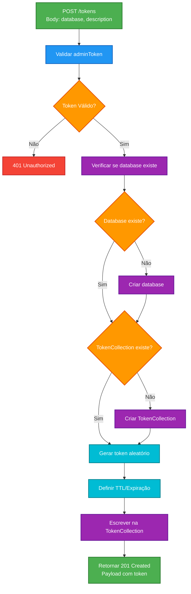
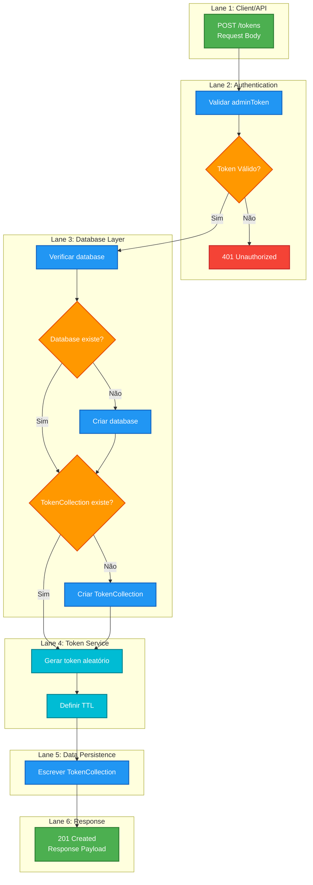

# Workflow Cross-Funcional: Rota /tokens

## Diagrama Mermaid



## Diagrama Cross-Funcional com Swimlanes



## Payload de Exemplo

### Request
```json
{
  "database": "validationsplugin",
  "description": "commandline_tool"
}
```

### Response (201 Created)
```json
{
  "token": "2922f524f758fcc8f0c08bff93771a1e",
  "database": "validationsplugin", 
  "description": "commandline_tool",
  "created_at": "2025-09-18T13:31:49.779353Z",
  "last_used_at": null,
  "expires_at": null
}
```

## Requisitos Técnicos

- **Autenticação**: adminToken obrigatório no header Authorization
- **Escopo**: Tokens limitados à database especificada
- **TTL**: Configurável para expiração automática ou permanente
- **Persistência**: Armazenamento na collection TokenCollection da database correspondente
- **Response**: HTTP 201 com metadados completos do token criado